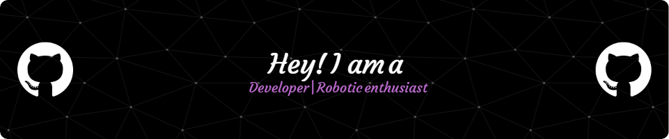

  
  
  # Hey there! 👋 I'm Amaan

##  About Me 🕵🏼

I build things that move, simulate environments to learn more, and engineer systems at the intersection of software and robotics.

From testing inverse kinematics for Mars rover arms to writing low-level C simulations, I live for the challenge of making hardware and software work together seamlessly. I don’t just write code; I design intelligent systems, solve complex physics problems, and obsess over the details that bring projects to life.

## Hand Picked Favorites 😸

### [**Real-time Bubble Detection**](https://github.com/Amaan103/bubble_detection)
A high-performance computer vision system for real-time fluid analysis and bubble classification.

**Tech Stack**:
Python, OpenCV, ROS 2, Jetson Nano.

- **Multi-Sensor Fusion**: Engineered a sophisticated 4-tier classification algorithm (NO/LOW/MEDIUM/HIGH) combining Area, Motion, Edge density, and LBP texture analysis.
- **Robust Tracking**: Implemented hysteresis tracking for stable state transitions across dynamic fluid samples.
- **Hardware Optimized**: Tuned the vision pipeline for Jetson Nano deployments, achieving 15-25 FPS with live CSV logging and USB webcam support.
- **ROS 2 Integration**: Built a custom ROS 2 package for seamless integration into larger robotics or laboratory automation ecosystems.

### [**Rover Arm Vision Control with ArUco**](https://github.com/Amaan103/Rover-arm-vision-control-with-AruCo)
A foundational vision-based control system for a rover arm using ArUco marker detection and 3D pose estimation.

**Tech Stack**:
Python, OpenCV, NumPy.

- **3D Pose Estimation**: Developed an OpenCV-based script to detect ArUco markers and accurately compute their 3D pose (translation and rotation vectors).
- **Camera Calibration**: Included a comprehensive camera calibration pipeline using chessboard patterns to extract intrinsic parameters and distortion coefficients for high-precision tracking.
- **Future-Ready**: Built the framework as the first step toward a full control panel overlay system for intuitive, vision-guided robotic arm manipulation.

### [**Conway's Game of Life (SDL2)**](https://github.com/Amaan103/Game-Of-Life)
A highly visual, performant implementation of the classic cellular automaton written in C, featuring a custom cell-aging visualizer.

**Tech Stack**:
C, SDL2.

- **Age-Based Rendering**: Designed a unique coloring algorithm that tracks cell lifespans, dynamically shifting colors from bright green for newborns to pure white for ancient, static structures.
- **High-Performance**: Leveraged SDL2 hardware acceleration and optimized memory arrays to maintain smooth, continuous rendering across a toroidal grid.

## Blog posts & Notes
<!-- BLOG-POST-LIST:START -->
- [Exploring Inverse Kinematics with ROS 2 and Gazebo](#)
- [Simulating a 5-DOF Robotic Arm for a Mars Rover](#)
- [Visualizing Cellular Automata with C and SDL2](#)
<!-- BLOG-POST-LIST:END -->
